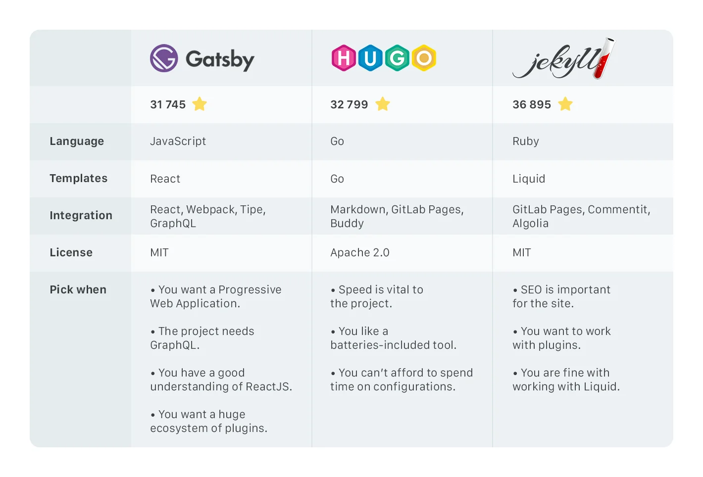
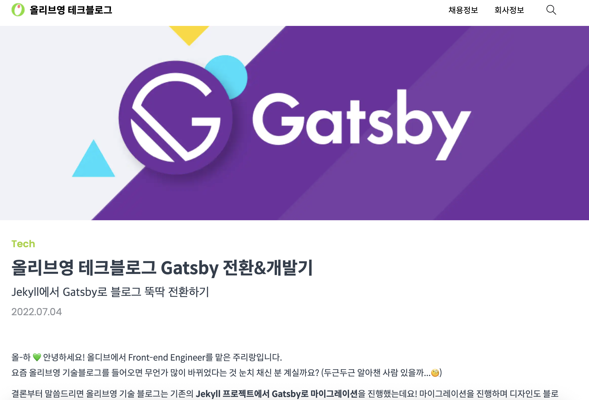

## github blog 를 선택 한 이유.

2025년 하반기부터 배우고 느낀것들을 github blog에 기록하려고 합니다.

시간이 지나고 보니 남는건, **배우고 느낀걸 기록하는거** 밖에 없더라구요.

깃험 블로그로 글을 올리면 목표했던 1 day 1 commit 도 지킬 수 있고,

무엇보다도 갓생을 살고 싶었습니다.

---
 

github blog 는 Github Pages 를 통한 **무료 호스팅**과 **커스텀 자유도가 높다**는 강점이 있는거 같습니다.

나도 한번 해볼까? 라는 생각이 들면 고민 없이 해보시면 됩니다.

해보고 마크다운 형식으로 글을 쓰는게 안맞다 싶으시면,

다른 블로그 플랫폼(tistory, velog)을 사용하시면 됩니다.

---

## Framework -> Gatsby 선정

어떤 프레임워크를 사용해서 blog를 운영할 지 고민했습니다.

검색해 봤을때는, jekyll, gatsby, hugo 중에 선택하는 분위기 였습니다.

jekyll, gatsby, hugo 각각의 프레임워크에 대한 비교 사진을 첨부 하겠습니다 🍀

---
 

어떤 프레임워크가 좋을까 한참을 고민하던 중 올리브영 테크 블로그의 한 글을 보게 되었습니다.

올리브영 테크블로그에서는 `jekyll` 프레임워크를 사용한 기술 블로그를 운영하고 있었는데

여러 이유로 `gatsby` 프레임워크로 마이그레이션 했다는 글을 보고

프레임워크를 `gatsby`로 선정하게 되었습니다. (저는 마이그레이션 하기 싫어요 😢)

---

## gatsby 테마 찾기

>블로그를 기획하고 디자인하고 코드 작성하고 seo 설정하고 ...

저에게는 그럴 시간이 없었습니다.

`gatsby` 테마를 찾아야 했습니다.

유명한 github blog를 돌아다니며 가장 마음에 드는 테마를 찾아야 했습니다.

그 중에 저는 **한국인 개발자분들**이 작성한 ['gatsby-starter-hoodie'](https://github.com/devHudi/gatsby-starter-hoodie) 가 가장 마음에 들었습니다.

깔끔하고 심플하며, 사용법이 간단했습니다.

## 다음편에는?
 

다음편에는 Github Pages 를 통해 

**repository**를 만들고 **배포**하는 과정을 담아보겠습니다. 😆